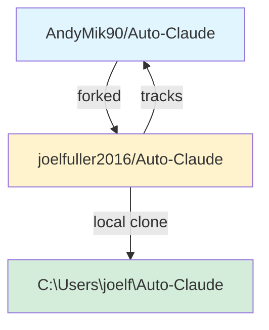

# Fork Schema: Auto-Claude
**AI-Optimized Quick Reference**

> **Purpose**: Fast fork relationship lookup for AI agents
> **Generated**: 2026-01-01
> **Schema Version**: 1.0
> **Base Commit**: 7210610 (develop)

---

## 🔗 FORK LINEAGE



### Relationship Matrix

| Attribute | Value |
|-----------|-------|
| **Upstream Owner** | AndyMik90 |
| **Upstream Repo** | https://github.com/AndyMik90/Auto-Claude |
| **Fork Owner** | joelfuller2016 |
| **Fork Repo** | https://github.com/joelfuller2016/Auto-Claude |
| **Local Path** | C:\Users\joelf\Auto-Claude |
| **Default Branch** | develop |
| **Sync Status** | ✅ SYNCED (as of 2026-01-01) |
| **Commits Ahead** | 0 |
| **Commits Behind** | 0 |

### Remote Configuration

```bash
# View remotes
$ git remote -v
origin    https://github.com/joelfuller2016/Auto-Claude.git  (fork)
upstream  https://github.com/AndyMik90/Auto-Claude.git       (original)

# Current branch
$ git branch
* develop
```

---

## 🌿 BRANCH STRATEGY

### Upstream Branches (AndyMik90/Auto-Claude)

```
main (protected)
 ├─ Purpose: Stable releases only
 ├─ Merge from: develop (via PR)
 ├─ CI/CD: Release workflow
 └─ Version tags: v2.7.2, v2.8.0, etc.

develop (default, protected)
 ├─ Purpose: Active development
 ├─ PRs target: This branch
 ├─ CI checks: REQUIRED
 │   ├─ test-frontend
 │   ├─ test-python (3.12, 3.13)
 │   ├─ lint
 │   ├─ CodeQL (Python, JS/TS)
 │   └─ CLA check
 └─ Status: All checks must pass
```

### Fork Branches (joelfuller2016/Auto-Claude)

```
develop
 ├─ Tracks: upstream/develop
 ├─ Purpose: Custom features + upstream sync
 ├─ Current state: Synced with upstream
 └─ Custom changes: Uncommitted (work in progress)

feature/* (local only, not pushed)
 └─ Experimental work
```

### Branch Flow Diagram

```
UPSTREAM (AndyMik90/Auto-Claude)
    │
    │ upstream/develop (7210610)
    │
    ↓ git fetch upstream
    ↓ git merge upstream/develop
    │
FORK (joelfuller2016/Auto-Claude)
    │
    │ origin/develop (7210610)
    │
    ↓ git pull origin develop
    │
LOCAL (C:\Users\joelf\Auto-Claude)
    │
    │ develop (7210610)
    └─ Working directory: Modified files uncommitted
```

---

## 🔄 SYNC PROTOCOL

### Standard Sync Workflow

```bash
# 1. Fetch upstream changes
git fetch upstream

# 2. Check sync status
git status
git log --oneline upstream/develop..HEAD
# (Empty output = fully synced)

# 3. Merge upstream into local develop
git checkout develop
git merge upstream/develop

# 4. Push to fork
git push origin develop

# 5. Verify sync
git log --oneline -1
# Expected: 7210610 Fix/windows issues (#471)
```

### Last Sync Details

| Attribute | Value |
|-----------|-------|
| **Last Synced** | 2026-01-01 |
| **Upstream Commit** | 7210610 |
| **Commit Message** | Fix/windows issues (#471) |
| **Author** | Andy |
| **Date** | 2 hours ago (from current timestamp) |

### Sync Verification Commands

```bash
# Fast check (are we synced?)
git fetch upstream && git log --oneline upstream/develop..HEAD
# Empty output = synced ✅

# Detailed check (what's different?)
git diff upstream/develop..HEAD --stat

# Check for incoming changes
git log --oneline HEAD..upstream/develop
```

---

## 🎯 MAJOR CHANGES IN FORK

### 1. GitHub PR Creation Feature
**Status**: Implemented (in review)
**Complexity**: High
**Files Changed**: 8 files
**Lines Added**: ~1,200 lines

#### Backend Implementation
| File | Lines | Purpose |
|------|-------|---------|
| `apps/backend/runners/github/gh_client.py` | 838-891 | GitHub CLI wrapper for PR operations |
| `apps/backend/runners/github/runner.py` | 321-391 | CLI command handler for `pr-create` |

**Key Functions**:
```python
# gh_client.py
async def pr_create(base, head, title, body, draft=False) -> dict
    # Wraps: gh pr create --base X --head Y --json number,url,title,state

# runner.py
async def cmd_pr_create(args) -> int
    # CLI: python runner.py pr-create --base main --head feat --title "..." --body "..."
```

#### Frontend Implementation
| File | Lines | Purpose |
|------|-------|---------|
| `apps/frontend/src/main/ipc-handlers/github/pr-handlers.ts` | 1550-1669 | IPC handler with progress events |
| `apps/frontend/src/preload/api/task-api.ts` | 159-198 | IPC bridge with cleanup functions |
| `apps/frontend/src/renderer/components/task-detail/TaskDetailModal.tsx` | 165-251 | UI component (⚠️ has memory leak, see Issue #11) |

**IPC Channels**:
- `github:pr:create` - Fire-and-forget trigger
- `github:pr:createProgress` - Progress updates
- `github:pr:createComplete` - Success with PR details
- `github:pr:createError` - Error messages

#### Tests Added
| File | Tests | Coverage |
|------|-------|----------|
| `task-api.pr.test.ts` | 26 tests | IPC integration (✅ passing) |
| `TaskDetailModal.pr.test.tsx` | 21 tests | Component behavior (✅ passing) |

**Total Test Coverage**: 47 tests, all passing

#### Known Issues
- ⚠️ **Issue #11**: Memory leak - Event listeners not cleaned up on component unmount
- See `DEEP_REVIEW_FINDINGS.md` for complete issue list

---

### 2. Debug Page Feature
**Status**: Partial (1/4 panels functional)
**Complexity**: Medium
**Files Changed**: 7 files
**Lines Added**: ~600 lines

#### Components
| Component | File | Status | Lines |
|-----------|------|--------|-------|
| DebugPage | DebugPage.tsx | ✅ Working | 82 |
| ConfigInspector | ConfigInspector.tsx | ✅ Working | 124 |
| IPCTester | IPCTester.tsx | ❌ Simulated | 168 |
| LogViewer | LogViewer.tsx | ❌ Simulated | 97 |
| RunnerTester | RunnerTester.tsx | ❌ Simulated | 141 |

#### i18n Support
- `apps/frontend/src/shared/i18n/locales/en/debug.json` - English translations
- `apps/frontend/src/shared/i18n/locales/fr/debug.json` - French translations
- ⚠️ **i18n Violation**: DebugPage.tsx lines 17-19 (hardcoded English)

---

### 3. Documentation Added
| File | Lines | Purpose |
|------|-------|---------|
| `AUTO_CLAUDE_SCHEMA.md` | 556 | AI-readable architecture guide |
| `FORK_DOCUMENTATION.md` | 799 | Comprehensive fork documentation |
| `DEEP_REVIEW_FINDINGS.md` | 300+ | Code review results with issues |
| `CREATE_PR_IMPLEMENTATION_PLAN.md` | 400+ | Implementation plan for PR feature |
| `FORK_SCHEMA.md` | This file | AI-optimized quick reference |

---

## 📜 KEY COMMIT HISTORY

### Recent Commits (Last 30 Days)

```
7210610 - Andy, 2 hours ago: Fix/windows issues (#471) ← SYNCED
  ├─ Security fixes, Windows compatibility
  └─ Merged into both upstream/develop and fork/develop

52a4fcc - Andy, 18 hours ago: fix(ci): add Rust toolchain for Intel Mac builds (#459)

fb6b7fc - Pranaveswar, 19 hours ago: fix: create spec.md during roadmap conversion (#446)

0f9c5b8 - Andy, 19 hours ago: fix(pr-review): treat LOW findings as ready (#455)

5d8ede2 - Andy, 20 hours ago: Fix/2.7.2 beta12 (#424)
  └─ Multiple bug fixes and improvements

da31b68 - Vinícius, 26 hours ago: feat: remove top bars (#386)

2effa53 - Abe, 28 hours ago: fix: prevent infinite re-render loop (#442)

c15bb31 - Abe, 29 hours ago: fix: accept Python 3.12+ in install (#443)

203a970 - Abe, 31 hours ago: fix: infinite loop in useTaskDetail (#444)

3c0708b - Vinícius, 2 days ago: fix(windows): resolve EINVAL error in VS Code (#434)
```

### Fork-Specific Commits (Uncommitted)

**Current State**: Working directory has ~50 modified files, all uncommitted

**Major Changes**:
1. PR creation feature (backend + frontend + tests)
2. Debug page components (5 files)
3. i18n translations for debug page (2 files)
4. Documentation files (5 files)

**Recommendation**: Commit changes in logical groups:
```bash
# Group 1: PR creation backend
git add apps/backend/runners/github/{gh_client.py,runner.py}
git commit -s -m "feat(backend): add GitHub PR creation support"

# Group 2: PR creation frontend
git add apps/frontend/src/main/ipc-handlers/github/pr-handlers.ts
git add apps/frontend/src/preload/api/task-api.ts
git add apps/frontend/src/renderer/components/task-detail/TaskDetailModal.tsx
git commit -s -m "feat(frontend): add PR creation UI and IPC handlers"

# Group 3: PR creation tests
git add apps/frontend/src/**/*pr.test.{ts,tsx}
git commit -s -m "test: add comprehensive PR creation test suite (47 tests)"

# Group 4: Debug page
git add apps/frontend/src/renderer/components/debug/*.tsx
git add apps/frontend/src/shared/i18n/locales/*/debug.json
git commit -s -m "feat(frontend): add debug page with config inspector"

# Group 5: Documentation
git add {AUTO_CLAUDE_SCHEMA,FORK_DOCUMENTATION,FORK_SCHEMA,DEEP_REVIEW_FINDINGS}.md
git commit -s -m "docs: add comprehensive fork and architecture documentation"
```

---

## 🤖 FOR AI AGENTS

### Quick Decision Matrix

| Scenario | Action |
|----------|--------|
| Creating PR to upstream | **ALWAYS** target `develop` branch |
| Need latest upstream code | `git fetch upstream && git merge upstream/develop` |
| Check if synced | `git log --oneline upstream/develop..HEAD` (empty = synced) |
| Starting new feature | Branch from `upstream/develop`, not `fork/develop` |
| Committing changes | Always use `-s` flag: `git commit -s -m "..."` |
| Commit message format | `feat:`, `fix:`, `docs:`, `refactor:`, `test:`, `chore:` |
| Before pushing | Run `npm run typecheck` |
| i18n compliance | No hardcoded strings, use `t('namespace:key')` |

### Critical Files to Review Before Changes

1. **CLAUDE.md** - Project instructions for AI agents
2. **CONTRIBUTING.md** - Contribution guidelines
3. **This file (FORK_SCHEMA.md)** - Fork relationship
4. **DEEP_REVIEW_FINDINGS.md** - Known issues and technical debt

### Common AI Agent Tasks

#### Task: "Sync fork with upstream"
```bash
git fetch upstream
git checkout develop
git merge upstream/develop
git push origin develop
```

#### Task: "Create feature branch"
```bash
git fetch upstream
git checkout -b feature/my-feature upstream/develop
# Work on feature...
git push origin feature/my-feature
```

#### Task: "Submit PR to upstream"
```bash
# Verify commits
git log --oneline upstream/develop..HEAD

# Create PR
gh pr create --repo AndyMik90/Auto-Claude --base develop \
  --title "feat: add my feature" \
  --body "Description of changes"
```

#### Task: "Check if upstream has new changes"
```bash
git fetch upstream
git log --oneline HEAD..upstream/develop
# Output shows incoming commits
```

---

## 🔍 VERIFICATION CHECKLIST

### Before Committing Changes
- [ ] Run `npm run typecheck` (TypeScript check)
- [ ] Run `npm run lint` (Code style check)
- [ ] Verify no hardcoded strings (i18n compliance)
- [ ] Sign commits with `-s` flag
- [ ] Use conventional commit format

### Before Creating Upstream PR
- [ ] Sync with latest `upstream/develop`
- [ ] Resolve all merge conflicts
- [ ] All CI checks pass locally
- [ ] Tests added/updated if needed
- [ ] Documentation updated if needed
- [ ] PR targets `develop` branch (NOT `main`)
- [ ] Descriptive PR title and body
- [ ] Link to related issues (if any)

### After Upstream Merge
- [ ] Pull merged changes: `git pull upstream develop`
- [ ] Push to fork: `git push origin develop`
- [ ] Delete feature branch: `git branch -d feature/my-feature`
- [ ] Update fork documentation if needed

---

## 📊 FORK STATISTICS

### Code Changes
```
Total Files Modified: ~50 files
├─ Backend:  2 files  (~1,200 lines)
├─ Frontend: 8 files  (~1,800 lines)
├─ Tests:    2 files  (~800 lines)
├─ i18n:     2 files  (~200 lines)
└─ Docs:     5 files  (~3,000 lines)

Total Lines Added: ~7,000 lines
```

### Test Coverage
```
Backend Tests:  0 tests (PR feature not unit tested yet)
Frontend Tests: 47 tests (26 IPC + 21 component)
E2E Tests:      0 tests

Test Status: ✅ All 47 tests passing
Coverage:    IPC layer fully covered, backend needs tests
```

### Issues Created
```
GitHub Issues (joelfuller2016/Auto-Claude):
├─ #11: Memory leak in TaskDetailModal event listeners (Medium severity)
└─ (More issues may exist, see DEEP_REVIEW_FINDINGS.md)
```

---

## 🔗 REFERENCES

### Repositories
- **Upstream**: https://github.com/AndyMik90/Auto-Claude
- **Fork**: https://github.com/joelfuller2016/Auto-Claude
- **Local**: C:\Users\joelf\Auto-Claude

### Related Documentation
- **AUTO_CLAUDE_SCHEMA.md**: Complete architecture guide
- **FORK_DOCUMENTATION.md**: Detailed fork documentation
- **DEEP_REVIEW_FINDINGS.md**: Code review with issue list
- **CLAUDE.md**: Project instructions for Claude Code

### Useful Commands
```bash
# Quick sync check
git fetch upstream && git log --oneline upstream/develop..HEAD

# Detailed diff with upstream
git diff upstream/develop..HEAD --stat

# View fork vs upstream branches
git log --oneline --graph --all -20
```

---

**Schema Version**: 1.0
**Last Updated**: 2026-01-01
**Maintained By**: joelfuller2016
**AI Agent Optimized**: Yes ✓

**Quick Links**:
- [Upstream Repo](https://github.com/AndyMik90/Auto-Claude)
- [Fork Repo](https://github.com/joelfuller2016/Auto-Claude)
- [Issue #11 (Memory Leak)](https://github.com/joelfuller2016/Auto-Claude/issues/11)
- [DEEP_REVIEW_FINDINGS.md](./DEEP_REVIEW_FINDINGS.md)
